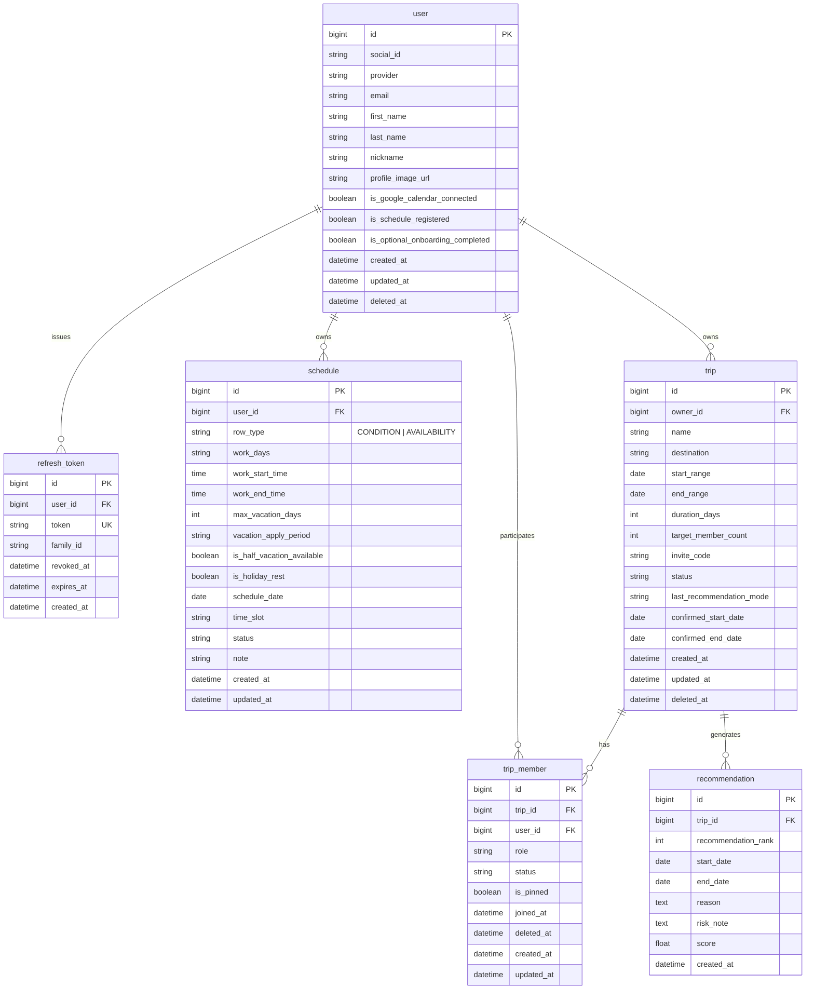

# TripFit ERD

> NotebookLM 03 + 2026-07-08 확정 병합. 비즈니스 규칙: `docs/product/business-rules/`.  
> **구현 상태:** wave 1 JPA는 아직 `user_condition`·`member_schedule` — wave 2 스펙에서 `schedule` 통합(A안) 마이그레이션 예정.

## 1. 개요

- **데이터 모델 설계 목적:** 다수 참여자 일정 수집·가중치 기반 추천·확정을 지원하는 MVP 데이터 구조
- **설계 원칙:**
  - **snake_case**, **단수형** 테이블명
  - **Soft delete:** `user`, `trip`, `trip_member` — `deleted_at`
  - **bigint** PK, BR-* 및 백엔드 확정 사항 반영
  - **User 전역 일정:** `schedule` 테이블 — 모든 여행방에 자동 반영 (BR-USER-008)
- **대상 DB:** MySQL 8.0 (예약어 `user`, `rank` 등 — JPA `@Column` 명시)

## 2. Mermaid ERD (A안 — SSOT)

## 3. 테이블 정의 (MVP In Scope)

### `user`

- **관련 BR:** BR-USER-001, BR-USER-003(wave 4)
- **관련 결정:** [`007-user-profile-onboarding.md`](../decisions/007-user-profile-onboarding.md), [`006-profile-image-url-storage.md`](../decisions/006-profile-image-url-storage.md)

| 컬럼 | 타입 | Nullable | PK/FK | 설명 |
|------|------|----------|-------|------|
| id | bigint | N | PK | |
| social_id | varchar | N | | |
| provider | varchar | N | | KAKAO, GOOGLE, APPLE |
| email | varchar | Y | | UNIQUE 아님 |
| first_name | varchar | Y | | PATCH profile 필수 |
| last_name | varchar | Y | | PATCH profile 필수 |
| nickname | varchar | Y | | 소셜 prefill, fallback 없음 |
| profile_image_url | varchar | Y | | wave 1 CDN / wave 4 S3 B안 |
| is_google_calendar_connected | boolean | N | | default false |
| is_schedule_registered | boolean | N | | **`schedule` row_type=CONDITION 저장 시 true** |
| is_optional_onboarding_completed | boolean | N | | default false |
| created_at | timestamptz | N | | |
| updated_at | timestamptz | N | | |
| deleted_at | timestamptz | Y | | Soft delete |

**인덱스:** `UNIQUE (provider, social_id)`

### `refresh_token`

wave 1+. [`004-auth-token-rotation.md`](../decisions/004-auth-token-rotation.md), [`auth-token-rotation.md`](../specs/auth-token-rotation.md)

| 컬럼 | 타입 | Nullable | PK/FK | 설명 |
|------|------|----------|-------|------|
| id | bigint | N | PK | |
| user_id | bigint | N | FK → user.id | |
| token | varchar(255) | N | | UNIQUE |
| family_id | char(36) | N | | UUID |
| revoked_at | timestamptz | Y | | wave 4 RTR |
| expires_at | timestamptz | N | | |
| created_at | timestamptz | N | | |

### `schedule` (A안 — 근무·연차 + 날짜별 가용성 통합)

User 소유. **trip FK 없음.** 변경 시 참여 중인 **모든 여행방** 추천 입력에 반영 (BR-USER-008).

- **관련 BR:** BR-TRIP-002, BR-TRIP-003, BR-TRIP-004, BR-TRIP-006, BR-USER-006, BR-USER-008

| row_type | 용도 | user당 행 수 |
|----------|------|--------------|
| `CONDITION` | 근무·연차 프로필 (구 `user_condition`) | **1** |
| `AVAILABILITY` | 날짜·시간대별 가능/불가/미정 (구 `member_schedule`) | **0..N** |

| 컬럼 | 타입 | Nullable | PK/FK | row_type | 설명 |
|------|------|----------|-------|----------|------|
| id | bigint | N | PK | * | |
| user_id | bigint | N | FK → user.id | * | |
| row_type | varchar | N | | * | `CONDITION` \| `AVAILABILITY` |
| work_days | varchar | Y | | CONDITION | `MON,TUE,...` |
| work_start_time | time | Y | | CONDITION | |
| work_end_time | time | Y | | CONDITION | |
| max_vacation_days | int | Y | | CONDITION | 여행당 최대 연차 |
| vacation_apply_period | varchar | Y | | CONDITION | 당일, 1주 전 등 |
| is_half_vacation_available | boolean | Y | | CONDITION | default false |
| is_holiday_rest | boolean | Y | | CONDITION | default false |
| schedule_date | date | Y | | AVAILABILITY | |
| time_slot | varchar | Y | | AVAILABILITY | MORNING, AFTERNOON, EVENING |
| status | varchar | Y | | AVAILABILITY | POSSIBLE, IMPOSSIBLE, TBD |
| note | varchar | Y | | AVAILABILITY | 본인만 조회 (BR-TRIP-004) |
| created_at | timestamptz | N | | * | |
| updated_at | timestamptz | N | | * | |

**제약 (애플리케이션 또는 DB):**

- user당 `CONDITION` **1행**
- `UNIQUE (user_id, schedule_date, time_slot)` where `row_type=AVAILABILITY`
- `CONDITION` 저장 → `user.is_schedule_registered=true`

**시간대 (BR-TRIP-002):** MORNING 00–13, AFTERNOON 13–18, EVENING 18–24 `[제안]`

**trip 조회:** `trip.start_range`~`end_range`로 해당 user의 `AVAILABILITY` 행 필터

### `trip`

- **관련 BR:** BR-TRIP-001, 007–011

| 컬럼 | 타입 | Nullable | PK/FK | 설명 |
|------|------|----------|-------|------|
| id | bigint | N | PK | |
| owner_id | bigint | N | FK → user.id | 방장 |
| name | varchar | N | | 최대 20자 `[제안]` |
| destination | varchar | Y | | 여행지 MVP In |
| start_range | date | N | | 희망 기간 시작 |
| end_range | date | N | | 희망 기간 종료 |
| duration_days | int | N | | **m일만 저장**. n박은 UI 계산 |
| target_member_count | int | N | | |
| invite_code | varchar | N | | UNIQUE |
| status | varchar | N | | `ONGOING`, `CONFIRMED`, `CANCELED`, **`TERMINATED`** (기간 만료·종료) |
| last_recommendation_mode | varchar | Y | | BASIC, ALL_ATTEND, SAVE_VACATION, CERTAIN |
| cancel_reason | varchar | Y | | 취소·삭제 VOC. **wave 4** 구현 — Figma 플로우 있음 |
| confirmed_start_date | date | Y | | |
| confirmed_end_date | date | Y | | |
| created_at | timestamptz | N | | |
| updated_at | timestamptz | N | | |
| deleted_at | timestamptz | Y | | Soft delete |

**제약:** `duration_days` ≤ `end_range - start_range + 1` (BR-TRIP-008)

### `trip_member`

방별 **참여·응답 완료** 상태. 일정 데이터는 `schedule`(User)에 있음 (BR-USER-007).

- **관련 BR:** BR-USER-002, BR-USER-007

| 컬럼 | 타입 | Nullable | PK/FK | 설명 |
|------|------|----------|-------|------|
| id | bigint | N | PK | |
| trip_id | bigint | N | FK → trip.id | |
| user_id | bigint | N | FK → user.id | NOT NULL |
| role | varchar | N | | OWNER, MEMBER |
| status | varchar | N | | JOINED, RESPONDED |
| is_pinned | boolean | N | | default false. 홈 고정 (MVP In, wave 2) |
| joined_at | timestamptz | N | | |
| deleted_at | timestamptz | Y | | **trip soft delete 시 연쇄 soft** |
| created_at | timestamptz | N | | |
| updated_at | timestamptz | N | | |

**인덱스:** `UNIQUE (trip_id, user_id)` (삭제되지 않은 행 기준 — 구현 시 partial 또는 soft-delete-aware)

동명이인 `(2)` 표시: **DB 컬럼 없음** — BR-USER-009 조회 로직

### `recommendation`

**현재 모드 TOP 3만** 유지 (BR-TRIP-005). 갱신 시 **hard DELETE** 후 INSERT (BR-TRIP-010).

- **관련 BR:** BR-TRIP-005, 011, 012

| 컬럼 | 타입 | Nullable | PK/FK | 설명 |
|------|------|----------|-------|------|
| id | bigint | N | PK | |
| trip_id | bigint | N | FK → trip.id | |
| recommendation_rank | int | N | | 1, 2, 3 (`rank` 예약어 회피) |
| start_date | date | N | | |
| end_date | date | N | | |
| reason | text | Y | | 추천 근거 |
| risk_note | text | Y | | |
| score | float | Y | | `[제안]` 디버깅 |
| created_at | timestamptz | N | | |

**정책:** 모드 변경·trip 기간/일수 변경·trip soft delete → 해당 trip `recommendation` **hard DELETE**. `trip.last_recommendation_mode` 갱신.

## 4. 관계 요약

| From | To | 관계 | 설명 |
|------|-----|------|------|
| user | schedule | 1:N | CONDITION 1 + AVAILABILITY N |
| user | trip_member | 1:N | 여행방별 참여 |
| user | trip | 1:N | owner_id (방장) |
| user | refresh_token | 1:N | |
| trip | trip_member | 1:N | |
| trip | recommendation | 1:N | 최대 3 (현재 모드) |

## 5. MVP 범위와의 매핑

| MVP 기능 | 테이블 |
|----------|--------|
| 소셜 로그인·프로필 | `user`, `refresh_token` |
| 근무/연차·날짜별 가용성 | `schedule` |
| 여행방·초대·여행지 | `trip`, `trip_member` |
| 추천 4모드·TOP3·확정 | `recommendation`, `trip.last_recommendation_mode`, `trip.confirmed_*` |

**Out of Scope (향후)**

- `notification_history` — BR-NOTI-* (wave 3+)
- `trip_expense`, `reservation` 등

## 6. 삭제·갱신 정책 (확정)

| 대상 | 정책 |
|------|------|
| `trip` soft delete | `trip_member` **연쇄 soft delete**. `schedule`·User 데이터 **유지** |
| `recommendation` | 옵션/기간 변경·모드 변경·trip delete → **hard DELETE** |
| `schedule` | User 소유 — trip 삭제와 **무관** |
| 전역 연동 | AVAILABILITY 변경 → 모든 참여 trip의 추천 입력 즉시 반영 (재계산은 BR-TRIP-010) |

## 7. B안 — 물리 2테이블 (전환용 설계)

A안 `schedule.row_type`과 **1:1 매핑**. API·도메인은 동일(User 소유).

| A안 (`schedule`) | B안 테이블 | 비고 |
|------------------|------------|------|
| row_type=`CONDITION` | `user_work_profile` (user_id UNIQUE) | BR-TRIP-006 |
| row_type=`AVAILABILITY` | `user_availability` (user_id, schedule_date, time_slot UNIQUE) | BR-TRIP-002~004 |

전환 시: CONDITION/AVAILABILITY 행을 각 테이블로 split migration. `is_schedule_registered`·BR-USER-006/008 의미 **불변**.

## 8. 미정 / 구현 전

| 항목 | 내용 |
|------|------|
| `[미정]` | trip.status ↔ UI(응답대기중·조율중·일정 확정)·**`TERMINATED` 전환 조건** |
| `[미정]` | BR-TRIP-005 모드별 가중치, BR-TRIP-012 동점 |
| `[미정]` | BR-TRIP-010 변경 시 NOTI-003 |
| wave 2 | JPA `schedule` 통합, `is_pinned`, `TERMINATED`, `deleted_at`(trip_member) |
| wave 4 | `trip.cancel_reason` VOC API·UI |

## 기획 메모 (NotebookLM + 확정)

1. **MVP 핵심:** `user`, `schedule`, `trip`, `trip_member`, `recommendation` + `refresh_token`
2. **2026-07-08:** TERMINATED, Pin(`is_pinned`), cancel_reason wave 4, schedule A안, 전역 연동
3. 알림 이력 테이블 — ERD 범위 외 (wave 3)
