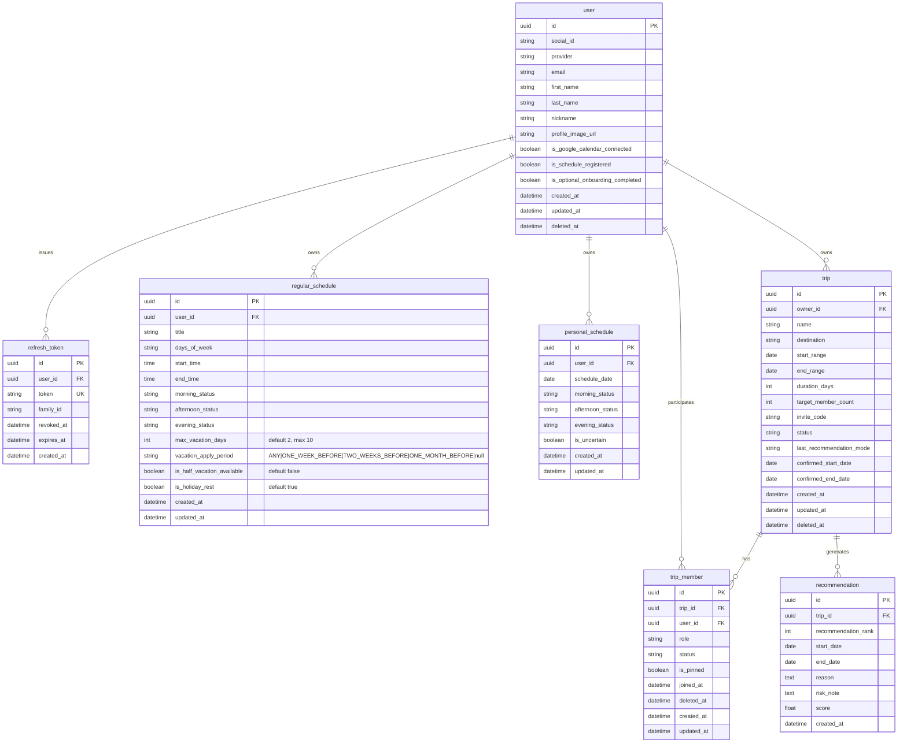

# TripFit ERD

> NotebookLM 03 + 2026-07-08 확정 병합. 비즈니스 규칙: `docs/product/business-rules/`.  
> **구현 상태:** wave 1 UUID PK 전환 완료. wave 2 `#11` — **정기/개별 2테이블** (`regular_schedule` · `personal_schedule`). A안 단일 `schedule` 폐기. 여행방 CRUD·추천은 후속 이슈.

## 1. 개요

- **데이터 모델 설계 목적:** 다수 참여자 일정 수집·가중치 기반 추천·확정을 지원하는 MVP 데이터 구조
- **설계 원칙:**
  - **snake_case**, **단수형** 테이블명
  - **Soft delete:** `user`, `trip`, `trip_member` — `deleted_at`
  - **UUID v4 PK** (`char(36)`), BR-* 및 백엔드 확정 사항 반영 — [`uuid-primary-key.md`](../specs/uuid-primary-key.md)
  - **User 전역 일정:** `regular_schedule`(정기) + `personal_schedule`(개별) — 모든 여행방에 자동 반영 (BR-USER-008)
- **대상 DB:** MySQL 8.0 (예약어 `user`, `rank` 등 — JPA `@Column` 명시)

## 2. Mermaid ERD (정기·개별 분리 — SSOT)

## 3. 테이블 정의 (MVP In Scope)

### `user`

- **관련 BR:** BR-USER-001, BR-USER-003(wave 4)
- **관련 결정:** [`007-user-profile-onboarding.md`](../decisions/007-user-profile-onboarding.md), [`006-profile-image-url-storage.md`](../decisions/006-profile-image-url-storage.md)

| 컬럼 | 타입 | Nullable | PK/FK | 설명 |
|------|------|----------|-------|------|
| id | char(36) | N | PK | UUID v4 |
| social_id | varchar | N | | |
| provider | varchar | N | | KAKAO, GOOGLE, APPLE |
| email | varchar | Y | | UNIQUE 아님 |
| first_name | varchar | Y | | PATCH profile 필수 |
| last_name | varchar | Y | | PATCH profile 필수 |
| nickname | varchar | Y | | 소셜 prefill, fallback 없음 |
| profile_image_url | varchar | Y | | wave 1 CDN / wave 4 S3 B안 |
| is_google_calendar_connected | boolean | N | | default false |
| is_schedule_registered | boolean | N | | **`regular_schedule` ≥1행 시 true** |
| is_optional_onboarding_completed | boolean | N | | default false |
| created_at | timestamptz | N | | |
| updated_at | timestamptz | N | | |
| deleted_at | timestamptz | Y | | Soft delete |

**인덱스:** `UNIQUE (provider, social_id)`

### `refresh_token`

wave 1+. [`004-auth-token-rotation.md`](../decisions/004-auth-token-rotation.md), [`auth-token-rotation.md`](../specs/auth-token-rotation.md)

| 컬럼 | 타입 | Nullable | PK/FK | 설명 |
|------|------|----------|-------|------|
| id | char(36) | N | PK | UUID v4 |
| user_id | char(36) | N | FK → user.id | |
| token | varchar(255) | N | | UNIQUE |
| family_id | char(36) | N | | UUID |
| revoked_at | timestamptz | Y | | wave 4 RTR |
| expires_at | timestamptz | N | | |
| created_at | timestamptz | N | | |

### `regular_schedule` (정기 일정)

User 소유. 출근·수업·회의 등 **복수 행**. **trip FK 없음** (BR-USER-008).

- **관련 BR:** BR-TRIP-006, BR-USER-006, BR-USER-008

| 컬럼 | 타입 | Nullable | PK/FK | 설명 |
|------|------|----------|-------|------|
| id | char(36) | N | PK | UUID v4 |
| user_id | char(36) | N | FK → user.id | |
| title | varchar | N | | 출근·수업·회의 등 표시명 |
| days_of_week | varchar | Y | | `MON,TUE,...` (구 work_days) |
| start_time | time | Y | | (구 work_start_time) |
| end_time | time | Y | | (구 work_end_time) |
| morning_status | varchar | Y | | 계산: MORNING 슬롯 POSSIBLE/IMPOSSIBLE |
| afternoon_status | varchar | Y | | AFTERNOON |
| evening_status | varchar | Y | | EVENING |
| max_vacation_days | int | N | | default **2**, 허용 **0~10** |
| vacation_apply_period | varchar | Y | | enum: `ANY` · `ONE_WEEK_BEFORE` · `TWO_WEEKS_BEFORE` · `ONE_MONTH_BEFORE`. default **null** |
| is_half_vacation_available | boolean | N | | default **false** (N) |
| is_holiday_rest | boolean | N | | default **true** (Y) |
| created_at | timestamptz | N | | |
| updated_at | timestamptz | N | | |

**제약:** user당 **0..N행**. 1행 이상 → `user.is_schedule_registered=true`. soft delete 없음.

### `personal_schedule` (개인 일정)

User 소유. **날짜당 1행** — 오전/오후/저녁 가능·불가 + 날짜 단위 불확실. **trip FK 없음.**

- **관련 BR:** BR-TRIP-002, BR-TRIP-003, BR-TRIP-004, BR-USER-008

| 컬럼 | 타입 | Nullable | PK/FK | 설명 |
|------|------|----------|-------|------|
| id | char(36) | N | PK | UUID v4 |
| user_id | char(36) | N | FK → user.id | |
| schedule_date | date | N | | |
| morning_status | varchar | N | | POSSIBLE / IMPOSSIBLE (`SlotStatuses`) |
| afternoon_status | varchar | N | | POSSIBLE / IMPOSSIBLE |
| evening_status | varchar | N | | POSSIBLE / IMPOSSIBLE |
| is_uncertain | boolean | N | | **날짜 전체** 불확실 (슬롯별 TBD 아님) |
| created_at | timestamptz | N | | |
| updated_at | timestamptz | N | | |

**제약:** `UNIQUE (user_id, schedule_date)`. soft delete 없음.

**시간대 (BR-TRIP-002, 확정):** MORNING `[00:00,13:00)`, AFTERNOON `[13:00,18:00)`, EVENING `[18:00,24:00)` — 공통 `TimeSlot` + `SlotStatuses` (정기와 동일)

**trip 조회:** `trip.start_range`~`end_range`로 해당 user의 `personal_schedule` 행 필터

### `trip`

- **관련 BR:** BR-TRIP-001, 007–011

| 컬럼 | 타입 | Nullable | PK/FK | 설명 |
|------|------|----------|-------|------|
| id | char(36) | N | PK | UUID v4 |
| owner_id | char(36) | N | FK → user.id | 방장 |
| name | varchar | N | | 최대 **15자** (BR-TRIP-001) |
| destination | varchar | Y | | 여행지 MVP In |
| start_range | date | N | | 희망 기간 시작 |
| end_range | date | N | | 희망 기간 종료 |
| duration_days | int | N | | **m일만 저장**. n박은 UI 계산 |
| target_member_count | int | N | | |
| invite_code | varchar | N | | UNIQUE |
| status | varchar | N | | `ONGOING`, `CONFIRMED`, `CANCELED`, **`TERMINATED`** (기간 만료·종료) |
| last_recommendation_mode | varchar | Y | | BASIC, ALL_ATTEND, SAVE_VACATION, CERTAIN |
| cancel_reason | varchar | Y | | 취소·삭제 VOC. **wave 4** 구현 — Figma 플로우 있음 |
| confirmed_start_date | date | Y | | |
| confirmed_end_date | date | Y | | |
| created_at | timestamptz | N | | |
| updated_at | timestamptz | N | | |
| deleted_at | timestamptz | Y | | Soft delete |

**제약:** `duration_days` ≤ `end_range - start_range + 1` (BR-TRIP-008)

### `trip_member`

방별 **참여·응답 완료** 상태. 일정 데이터는 User `personal_schedule`에 있음 (BR-USER-007).

- **관련 BR:** BR-USER-002, BR-USER-007

| 컬럼 | 타입 | Nullable | PK/FK | 설명 |
|------|------|----------|-------|------|
| id | char(36) | N | PK | UUID v4 |
| trip_id | char(36) | N | FK → trip.id | |
| user_id | char(36) | N | FK → user.id | NOT NULL |
| role | varchar | N | | OWNER, MEMBER |
| status | varchar | N | | JOINED, RESPONDED |
| is_pinned | boolean | N | | default false. 홈 고정 (MVP In, wave 2) |
| joined_at | timestamptz | N | | |
| deleted_at | timestamptz | Y | | **trip soft delete 시 연쇄 soft** |
| created_at | timestamptz | N | | |
| updated_at | timestamptz | N | | |

**인덱스:** `UNIQUE (trip_id, user_id)` (삭제되지 않은 행 기준 — 구현 시 partial 또는 soft-delete-aware)

동명이인 `(2)` 표시: **DB 컬럼 없음** — BR-USER-009 조회 로직

### `recommendation`

**현재 모드 TOP 3만** 유지 (BR-TRIP-005). 갱신 시 **hard DELETE** 후 INSERT (BR-TRIP-010).

- **관련 BR:** BR-TRIP-005, 011, 012

| 컬럼 | 타입 | Nullable | PK/FK | 설명 |
|------|------|----------|-------|------|
| id | char(36) | N | PK | UUID v4 |
| trip_id | char(36) | N | FK → trip.id | |
| recommendation_rank | int | N | | 1, 2, 3 (`rank` 예약어 회피) |
| start_date | date | N | | |
| end_date | date | N | | |
| reason | text | Y | | 추천 근거 |
| risk_note | text | Y | | |
| score | float | Y | | `[제안]` 디버깅 |
| created_at | timestamptz | N | | |

**정책:** 모드 변경·trip 기간/일수 변경·trip soft delete → 해당 trip `recommendation` **hard DELETE**. `trip.last_recommendation_mode` 갱신.

## 4. 관계 요약

| From | To | 관계 | 설명 |
|------|-----|------|------|
| user | regular_schedule | 1:N | 정기 일정 (출근·수업·회의 등) |
| user | personal_schedule | 1:N | 개인 일정 (날짜당 1행) |
| user | trip_member | 1:N | 여행방별 참여 |
| user | trip | 1:N | owner_id (방장) |
| user | refresh_token | 1:N | |
| trip | trip_member | 1:N | |
| trip | recommendation | 1:N | 최대 3 (현재 모드) |

## 5. MVP 범위와의 매핑

| MVP 기능 | 테이블 |
|----------|--------|
| 소셜 로그인·프로필 | `user`, `refresh_token` |
| 정기·개별 일정 | `regular_schedule`, `personal_schedule` |
| 여행방·초대·여행지 | `trip`, `trip_member` |
| 추천 4모드·TOP3·확정 | `recommendation`, `trip.last_recommendation_mode`, `trip.confirmed_*` |

**Out of Scope (향후)**

- `notification_history` — BR-NOTI-* (wave 3+)
- `trip_expense`, `reservation` 등

## 6. 삭제·갱신 정책 (확정)

| 대상 | 정책 |
|------|------|
| `trip` soft delete | `trip_member` **연쇄 soft delete**. 정기·개별 일정·User 데이터 **유지** |
| `recommendation` | 옵션/기간 변경·모드 변경·trip delete → **hard DELETE** |
| `regular_schedule` · `personal_schedule` | User 소유 — trip 삭제와 **무관** |
| 전역 연동 | 개별·정기 변경 → 모든 참여 trip의 추천 입력 즉시 반영 (재계산은 BR-TRIP-010) |

## 7. 폐기 — A안 단일 `schedule`

2026-07-13 이전 SSOT였던 `schedule` + `row_type` 단일 테이블은 **폐기**.  
현재 SSOT는 §2~3 `regular_schedule` + `personal_schedule`. (구 B안 `user_work_profile` 명칭은 쓰지 않음 — 정기 일정은 근무 전용 아님)

## 8. 미정 / 구현 전

| 항목 | 내용 |
|------|------|
| `[미정]` | BR-TRIP-005 가중치 · BR-TRIP-012 동점 · TERMINATED **전환 시점**(lazy vs 배치) |
| wave 2 잔여 | `#12` trip CRUD · members schedule-calendar · `#13` 추천 |
| wave 4 | `trip.cancel_reason` VOC API·UI |

## 기획 메모 (NotebookLM + 확정)

1. **MVP 핵심:** `user`, `regular_schedule`, `personal_schedule`, `trip`, `trip_member`, `recommendation` + `refresh_token`
2. **2026-07-08:** TERMINATED, Pin(`is_pinned`), cancel_reason wave 4, 전역 연동
3. **2026-07-13:** A안 폐기 → 정기/개별 2테이블, 정기 N행·title·범용 시간 필드
4. 알림 이력 테이블 — ERD 범위 외 (wave 3)
