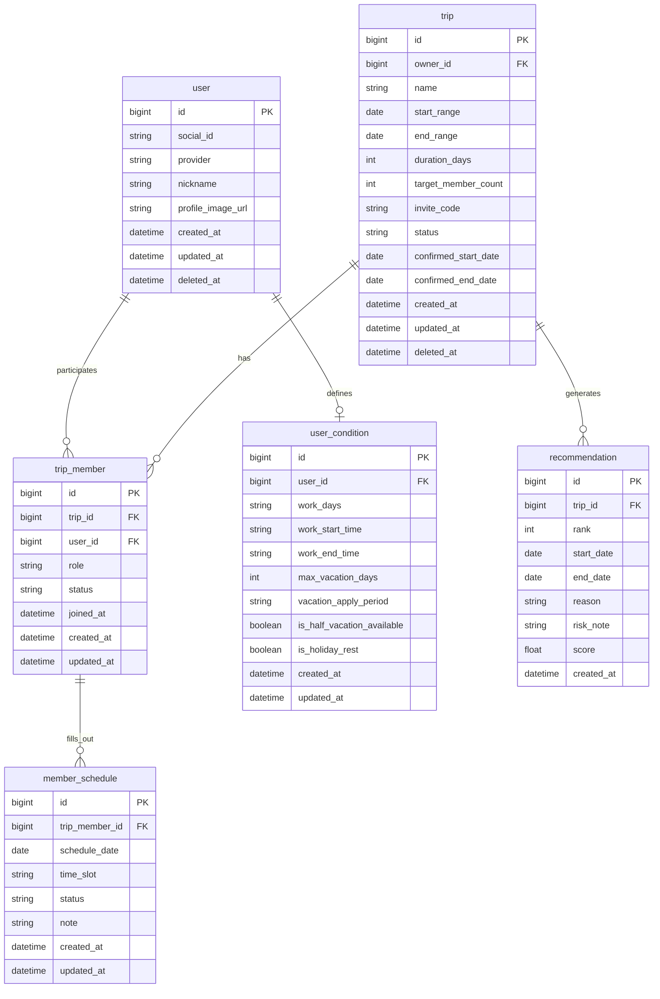

# TripFit ERD

> NotebookLM 기획 자료 정리본. 비즈니스 규칙은 `docs/product/business-rules/` 참고.

## 1. 개요

- **데이터 모델 설계 목적**: TripFit 서비스의 핵심인 여행방 생성, 참여자 일정 취합, 조건 기반 일정 추천 기능을 지원하기 위한 안정적이고 확장 가능한 데이터 구조 설계.
- **설계 원칙**:
  - 테이블 및 컬럼명은 **snake_case** 및 **단수형** 사용
  - **Soft Delete** 원칙 — `deleted_at`으로 데이터 보존
  - PK는 `bigint` Auto-increment ID
  - 비즈니스 규칙(BR-*)을 데이터 제약으로 반영
- **대상 DB**: **MySQL 8.0** (런타임). 논리 모델은 DB 중립적으로 유지하며, 예약어 컬럼·백틱 등 MySQL 제약은 구현 시 반영

## 2. Mermaid ERD

## 3. 테이블 정의 (MVP In Scope)

### `user` (사용자)

사용자 기본 정보 및 소셜 로그인 연동.

- **관련 BR**: BR-USER-001, BR-USER-003

| 컬럼 | 타입 | Nullable | PK/FK | 설명 |
|------|------|----------|-------|------|
| id | bigint | N | PK | 사용자 고유 ID |
| social_id | varchar | N | | 소셜 서비스 제공 ID |
| provider | varchar | N | | KAKAO, GOOGLE, APPLE 등 |
| nickname | varchar | N | | 닉네임 |
| profile_image_url | text | Y | | 프로필 이미지 URL |
| created_at | timestamptz | N | | 생성 시각 |
| updated_at | timestamptz | N | | 수정 시각 |
| deleted_at | timestamptz | Y | | Soft delete |

**인덱스:** `UNIQUE (provider, social_id)`

### `refresh_token` (리프레시 토큰)

wave 1 인증 Must Have. wave 4 RTR·Redis는 [`docs/specs/auth-token-rotation.md`](../specs/auth-token-rotation.md) 참고.

- **관련 결정:** [`004-auth-token-rotation.md`](../decisions/004-auth-token-rotation.md)

| 컬럼 | 타입 | Nullable | PK/FK | 설명 |
|------|------|----------|-------|------|
| id | bigint | N | PK | |
| user_id | bigint | N | FK → user.id | |
| token | varchar(255) | N | | opaque token. UNIQUE |
| family_id | char(36) | N | | UUID — login 체인 (wave 4 RTR) |
| revoked_at | timestamptz | Y | | wave 4 rotation. wave 1 logout은 row delete |
| expires_at | timestamptz | N | | |
| created_at | timestamptz | N | | |

**인덱스:** `UNIQUE (token)`, `INDEX (user_id)`, `INDEX (family_id)`

### `user_condition` (근무·연차 조건)

개인 근무 패턴 및 연차 제약. 온보딩·내 일정 관리에서 수집.

- **관련 BR**: BR-TRIP-006

| 컬럼 | 타입 | Nullable | PK/FK | 설명 |
|------|------|----------|-------|------|
| id | bigint | N | PK | |
| user_id | bigint | N | FK → user.id | 1:1 |
| work_days | varchar | Y | | 예: `MON,TUE,WED` |
| work_start_time | time | Y | | 출근 |
| work_end_time | time | Y | | 퇴근 |
| max_vacation_days | int | Y | | 여행당 최대 연차 |
| vacation_apply_period | varchar | Y | | 당일, 1주 전 등 |
| is_half_vacation_available | boolean | N | | 반차 가능 |
| is_holiday_rest | boolean | N | | 공휴일 휴무 |
| created_at | timestamptz | N | | |
| updated_at | timestamptz | N | | |

### `trip` (여행방)

여행방 설정 및 확정 정보.

- **관련 BR**: BR-TRIP-001, BR-TRIP-007, BR-TRIP-008

| 컬럼 | 타입 | Nullable | PK/FK | 설명 |
|------|------|----------|-------|------|
| id | bigint | N | PK | |
| owner_id | bigint | N | FK → user.id | 방장(총대) |
| name | varchar | N | | 여행방 이름 |
| start_range | date | N | | 희망 기간 시작 |
| end_range | date | N | | 희망 기간 종료 |
| duration_days | int | N | | 희망 여행 일수 (m일) |
| target_member_count | int | N | | 예상 참여 인원 |
| invite_code | varchar | N | | 초대 코드 |
| status | varchar | N | | `ONGOING`, `CONFIRMED`, `CANCELED` 등 |
| confirmed_start_date | date | Y | | 확정 시작일 |
| confirmed_end_date | date | Y | | 확정 종료일 |
| created_at | timestamptz | N | | |
| updated_at | timestamptz | N | | |
| deleted_at | timestamptz | Y | | Soft delete |

**제약:** `duration_days` ≤ `end_range - start_range + 1` (BR-TRIP-008, `[제안]`)

**인덱스:** `UNIQUE (invite_code)`

### `trip_member` (여행 참여자)

여행방–사용자 매핑 및 응답 상태.

- **관련 BR**: BR-USER-002

| 컬럼 | 타입 | Nullable | PK/FK | 설명 |
|------|------|----------|-------|------|
| id | bigint | N | PK | |
| trip_id | bigint | N | FK → trip.id | |
| user_id | bigint | Y | FK → user.id | 비회원 참여 시 `[미정]` |
| role | varchar | N | | `OWNER`, `MEMBER` |
| status | varchar | N | | `JOINED`, `RESPONDED` |
| joined_at | timestamptz | N | | 참여 시각 |
| created_at | timestamptz | N | | |
| updated_at | timestamptz | N | | |

**인덱스:** `UNIQUE (trip_id, user_id)` (user_id not null 시)

### `member_schedule` (참여자 일정)

날짜·시간대별 가용성. `note`는 본인만 조회 (BR-TRIP-004).

- **관련 BR**: BR-TRIP-002, BR-TRIP-003, BR-TRIP-004

| 컬럼 | 타입 | Nullable | PK/FK | 설명 |
|------|------|----------|-------|------|
| id | bigint | N | PK | |
| trip_member_id | bigint | N | FK → trip_member.id | |
| schedule_date | date | N | | 해당 날짜 |
| time_slot | varchar | N | | `MORNING`, `AFTERNOON`, `EVENING` |
| status | varchar | N | | `POSSIBLE`, `IMPOSSIBLE`, `TBD` |
| note | varchar | Y | | 개인 메모 `[제안]`, API에서 타인 노출 금지 |
| created_at | timestamptz | N | | |
| updated_at | timestamptz | N | | |

**인덱스:** `UNIQUE (trip_member_id, schedule_date, time_slot)`

### `recommendation` (추천 결과)

알고리즘 TOP 3 후보.

- **관련 BR**: BR-TRIP-005

| 컬럼 | 타입 | Nullable | PK/FK | 설명 |
|------|------|----------|-------|------|
| id | bigint | N | PK | |
| trip_id | bigint | N | FK → trip.id | |
| rank | int | N | | 1, 2, 3 |
| start_date | date | N | | 후보 시작 |
| end_date | date | N | | 후보 종료 |
| reason | text | Y | | 추천 근거 |
| risk_note | text | Y | | 리스크·주의 |
| score | float | Y | | 내부 점수 `[제안]` |
| created_at | timestamptz | N | | 산출 시각 |

## 4. 관계 요약

| From | To | 관계 | 설명 |
|------|-----|------|------|
| user | trip_member | 1:N | 사용자는 여러 여행방 참여 |
| user | refresh_token | 1:N | 사용자당 refresh token (wave 1+) |
| trip | trip_member | 1:N | 여행방에 여러 참여자 |
| trip_member | member_schedule | 1:N | 참여자별 슬롯 일정 |
| trip | recommendation | 1:N | 여행방당 TOP 3 후보 |
| user | user_condition | 1:1 | 사용자당 근무·연차 프로필 |

## 5. MVP 범위와의 매핑

**In Scope**

| MVP 기능 | 테이블 |
|----------|--------|
| 소셜 로그인·프로필 | `user`, `refresh_token` |
| 근무/연차 조건 | `user_condition` |
| 여행방 생성·초대 | `trip`, `trip_member` |
| 오전/오후/저녁 일정 응답 | `member_schedule` |
| TOP 3 추천·확정 | `recommendation`, `trip.confirmed_*` |

**Out of Scope (향후)**

- `trip_expense` — 가격/경비
- `trip_photo_schedule` — 사진 인식 일정
- `reservation` — 숙소/교통 예약 연동
- `notification` — 알림 이력 (BR-NOTI-*, 별도 설계)

## 6. 미정 / 기획 확인 필요

| 항목 | 내용 |
|------|------|
| `[미정]` 비회원 참여 | `trip_member.user_id` Nullable vs 게스트 세션 테이블 (BR-USER-002) |
| `[제안]` member_schedule.note | 본인 전용 일정 메모 |
| `[제안]` recommendation.score | 추천 디버깅·고도화용 |
| `[미정]` 삭제 정책 | trip soft delete 시 trip_member·member_schedule cascade 여부 |
| `[미정]` trip.status | DB enum(`ONGOING` 등) vs UI 상태(응답대기중·조율중·일정 확정) 매핑 |
| 알림 | BR-NOTI-*는 메시지 큐·히스토리 테이블 별도 검토 |

## 기획 메모 (NotebookLM)

1. MVP 핵심 테이블 6개: `user`, `user_condition`, `trip`, `trip_member`, `member_schedule`, `recommendation`
2. 기획 확인: 초대 링크 웹 참여 시 **로그인 강제 여부** → `trip_member.user_id` 정책
3. 알림 이력은 본 ERD 범위 외
