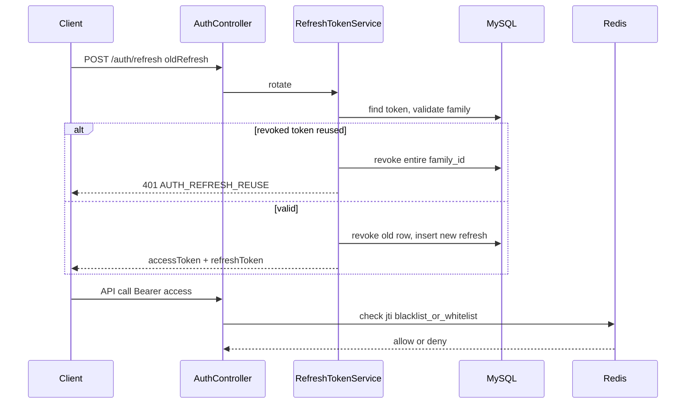

# 인증 토큰 Rotation — RTR + Redis

> wave: 4  
> 선행: wave 1 [`auth-social-login.md`](auth-social-login.md)  
> 결정: [`docs/decisions/004-auth-token-rotation.md`](../decisions/004-auth-token-rotation.md) — **RTR 확정**, **Redis 확정**, access blacklist/whitelist **`[미정]`**  
> 상태: Draft

## 목표

wave 1 이후 아래를 도입한다.

1. **Refresh Token Rotation (RTR)** — refresh 시 token 교체 + reuse detection
2. **Redis** — access JWT lifecycle 보조 (blacklist 또는 whitelist, 전략 확정 후 구현)

## 배경

- wave 1: DB refresh + stateless access JWT (`jti` 포함)
- 확정된 후속: RTR + Redis ([`004`](../decisions/004-auth-token-rotation.md))
- login API shape·단일 `POST /auth/login`은 **변경 없음**

### 관련 문서

| 문서 | 내용 |
|------|------|
| `auth-social-login.md` | wave 1 baseline |
| `004-auth-token-rotation.md` | RTR·Redis 결정 |
| `architecture/erd.md` | `refresh_token` + `family_id` |

## 아키텍처 개요



## 요구사항

### Must Have (wave 4)

- [ ] **RTR:** `POST /auth/refresh` 성공 시 새 `refreshToken` 발급, 기존 refresh revoke
- [ ] **Reuse detection:** revoke된 refresh 재사용 → `AUTH_REFRESH_REUSE` + 해당 `family_id` 전체 revoke
- [ ] **Redis 연동:** Spring Data Redis 또는 Lettuce — env 기반 host/port/password
- [ ] **Access JWT `jti` 검증:** Redis 연동 (`TokenRevocationChecker` 구현체 교체)
- [ ] logout 시 refresh revoke + access `jti` Redis 처리 (전략 확정 후)
- [ ] `./gradlew test` — RTR·reuse·Redis mock/integration

### `[미정]` — Redis access 전략 (Must Have 중 하나 선택 후 Approved)

**Option A — Blacklist (권장 검토)**

- 평소: Redis 미조회 또는 jti absent = 유효
- logout·강제 revoke: `SET auth:bl:{jti} 1 EX {remaining_ttl}`
- JwtFilter: jti 존재 시 401

**Option B — Whitelist**

- login·refresh 성공: `SET auth:wl:{jti} 1 EX {access_ttl}`
- JwtFilter: jti absent = 401
- logout: `DEL auth:wl:{jti}`

팀 합의 후 본 스펙·decisions `004` amend.

### Nice to Have

- [ ] user당 active refresh token 상한 (예: 5 devices)
- [ ] refresh token `device_label` / `last_used_at`

### Out of Scope

- refresh token Redis 저장
- OAuth provider token Redis cache
- 분산 refresh lock (DB transaction으로 시작)

## API 변경

### `POST /api/v1/auth/refresh` — wave 4 응답 확장

wave 1:

```json
{ "accessToken": "...", "expiresIn": 7200 }
```

**wave 4 (additive):**

```json
{
  "accessToken": "<jwt>",
  "refreshToken": "<new opaque token>",
  "expiresIn": 7200
}
```

- `login` 응답: **변경 없음**
- 클라이언트: wave 4 배포 시 refresh 응답의 `refreshToken` **필수 저장**

### 에러 추가

| HTTP | code | 상황 |
|------|------|------|
| 401 | `AUTH_REFRESH_REUSE` | 폐기된 refresh 재사용 — family 전체 revoke됨, 재로그인 필요 |

## 데이터 모델

### `refresh_token` — wave 4 컬럼 (wave 1에서 선반영 권장)

| 컬럼 | 타입 | Nullable | 설명 |
|------|------|----------|------|
| family_id | char(36) | N | UUID — 동일 로그인 체인. login 시 신규, rotation 시 유지 |
| revoked_at | datetime(6) | Y | revoke 시각. wave 4 rotation 시 set. wave 1 logout은 delete 가능 |

wave 1: login마다 새 `family_id`, `revoked_at` null. wave 4: rotation 시 old row `revoked_at` set (또는 soft revoke 후 delete 정책 — 구현 시 하나로 통일).

**인덱스 추가:** `INDEX (family_id)`, `INDEX (user_id, revoked_at)`

### Redis 키 (초안 — 전략 확정 후 SSOT)

| 키 패턴 | 용도 | TTL |
|---------|------|-----|
| `auth:bl:{jti}` | Blacklist | access 남은 수명 |
| `auth:wl:{jti}` | Whitelist | access 전체 수명 |

## 패키지 / 코드 (예정)

```
auth/
├── service/
│   ├── RefreshTokenService.java     # rotation, family revoke
│   └── security/
│       ├── TokenRevocationChecker.java
│       ├── NoOpTokenRevocationChecker.java
│       └── RedisTokenRevocationChecker.java   # wave 4
├── config/
│   └── RedisConfig.java             # wave 4
└── repository/
    ├── RefreshToken.java
    └── RefreshTokenRepository.java
```

패키징 가이드: `docs/decisions/003-architecture-guide.md`

## 환경 변수 (wave 4 추가)

| 변수 | 용도 |
|------|------|
| `REDIS_HOST` | Redis host |
| `REDIS_PORT` | 기본 6379 |
| `REDIS_PASSWORD` | optional |
| `AUTH_REDIS_MODE` | `blacklist` \| `whitelist` — `[미정]` |

`deploy/app/.env.example` wave 4 PR에서 갱신.

## 검증 시나리오

### RTR

- [ ] refresh 성공 → 새 refreshToken, 구 token으로 재refresh → 401
- [ ] 구 token reuse → `AUTH_REFRESH_REUSE`, family 전체 revoke
- [ ] login → refresh → refresh → chain 유효

### Redis (전략 확정 후)

- [ ] logout → access JWT 즉시 401 (blacklist 또는 whitelist)
- [ ] access 만료 후 Redis key 자동 소멸

## 완료 기준

- [ ] decisions `004` Redis 전략 `[미정]` → 확정 amend
- [ ] Approved 후 `./gradlew test` + staging Redis 연동
- [ ] 프론트: refresh 응답 `refreshToken` 저장 배포
- [ ] `erd.md` wave 4 컬럼·Redis 운영 메모 동기화

## 변경 이력

| 날짜 | 변경 |
|------|------|
| 2026-07-06 | 초안 — RTR·Redis 확정, access 전략 `[미정]` |
